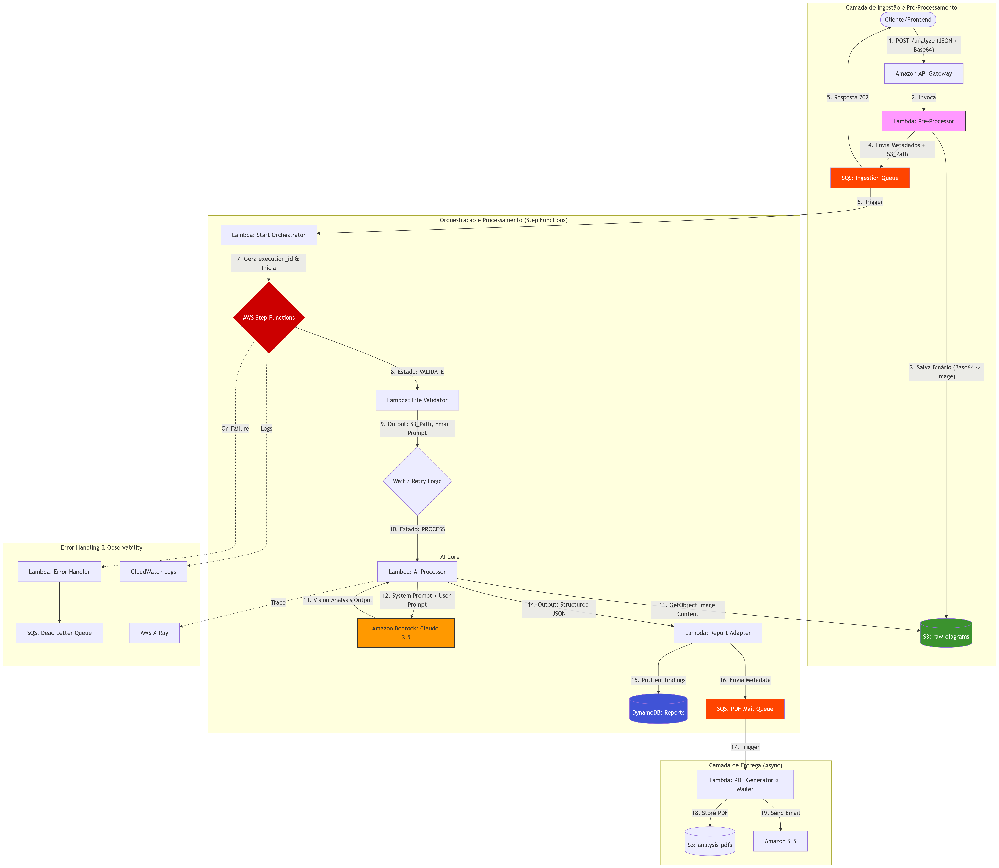

# auto-arch-analyzer

## Características

- ✅ API Gateway com endpoint POST /analyze
- ✅ SQS Ingestion Queue para processamento assíncrono
- ✅ SQS Dead Letter Queue para tratamento de erros
- ✅ Integração com Step Functions e Amazon Bedrock
- ✅ Retorno imediato com 202 Accepted
- ✅ Rastreamento com execution_id único
- ✅ Base64 encoding para diagramas

## Padrão de Commit

Antes de cada commit, execute o formatador para manter o código consistente:

```bash
ruff format src/
```

## Quick Start - API Gateway

### Obter URL da API

Após deployar com Terraform, obtenha a URL da API:

```bash
terraform apply
terraform output api_gateway_invoke_url
```

### Exemplo de Requisição

```bash
# Codificar imagem para base64
BASE64_IMAGE=$(base64 -w 0 < diagram.png)

# Enviar requisição
curl -X POST https://YOUR_API_URL/analyze \
  -H "Content-Type: application/json" \
  -d '{
    "email": "user@example.com",
    "prompt": "Analyze this architecture",
    "diagram": "'$BASE64_IMAGE'"
  }'
```

**Resposta (202 Accepted):**
```json
{
  "message": "Request accepted for processing",
  "execution_id": "550e8400-e29b-41d4-a716-446655440000",
  "status": "QUEUED",
  "timestamp": "2024-03-22T10:30:45.123456"
}
```


## Arquitetura

Este projeto implementa uma arquitetura AWS escalável e modular usando Terraform. A solução é composta por múltiplos componentes interconectados que trabalham juntos para fornecer uma infraestrutura robusta na nuvem.



A arquitetura inclui componentes de rede, computação, armazenamento, funções Lambda, orquestração e gerenciamento de identidade e acesso, permitindo uma solução completa e integrada para aplicações cloud-native.

## Componentes Principais

### API Gateway + Lambda (POST /analyze)
- Endpoint para submissão de diagramas de arquitetura
- Validação de payload (email, diagram, prompt)
- Retorna 202 Accepted imediatamente
- Gera execution_id único para rastreamento

### SQS Queues
- **Ingestion Queue**: Processa diagramas enviados
- **PDF/Mail Queue**: Fila assíncrona para geração de PDFs e emails
- **Dead Letter Queue**: Captura mensagens com erro após 3 retry attempts

### Funções Lambda
- **analyze-arch**: Handler do POST /analyze (30s timeout)
- **pdf-mail-consumer**: Consome a fila PDF/Mail e registra o processamento para geração de PDF/envio de e-mail

### Variáveis de Ambiente para Execução Local

Para rodar o Terraform localmente, você precisa exportar as seguintes variáveis de ambiente com suas credenciais AWS:

```sh
export AWS_ACCESS_KEY_ID="<your-access-key-id>"
export AWS_SECRET_ACCESS_KEY="<your-secret-access-key>"
export AWS_SESSION_TOKEN="<your-session-token>"
export AWS_DEFAULT_REGION="us-east-1"
```

Depois de exportar essas variáveis, você pode executar os comandos Terraform normalmente:


### Installation

1. Clone the repository:
    ```sh
    git clone <repository-url>
    cd <repository-directory>
    ```

2. Initialize Terraform:
    ```sh
    terraform init
    ```

3. Validate the Terraform configuration:
    ```sh
    terraform validate
    ```

4. Format the Terraform configuration:
    ```sh
    terraform fmt


### Configurar Variáveis de Ambiente no GitHub

Acesse o repositório no GitHub → Settings → Secrets and variables → Actions → Repository secrets

Adicione as seguintes variáveis:

| Variável | Valor | Descrição |
|----------|-------|-----------|
| `AWS_ACCESS_KEY_ID` | [Access Key criada na Etapa 3] | Chave de acesso do usuário IAM |
| `AWS_SECRET_ACCESS_KEY` | [Secret Key criada na Etapa 3] | Chave secreta do usuário IAM |
| `AWS_ACCOUNT_ID` | [ID da conta AWS] | ID numérico da conta AWS (12 dígitos) |
| `AWS_REGION` | `us-east-1` | Região AWS onde será feito o deploy |
| `IA_CONSUMER_API_URL` | [URL base da API externa] | URL base da API de IA; a lambda `ia_consumer` chama a rota `/analisar` |
| `IA_CONSUMER_API_KEY` | [Chave da API externa] | API key usada no header `X-API-Key` |
| `TERRAFORM_STATE_BUCKET` | [Nome do bucket criado na Etapa 4] | Bucket S3 para armazenar o estado do Terraform |


### Terraform State Backend Configuration

O estado do Terraform é armazenado em um bucket S3 com a seguinte configuração:

- **Bucket S3**: `auto-arch-analyzer-backend-terraform-state-files-dev`
- **State File Path**: `back_end_state_file/terraform.tfstate`

Esta configuração é utilizada durante a execução de `terraform init` e é automaticamente aplicada pelo workflow de CI/CD.
